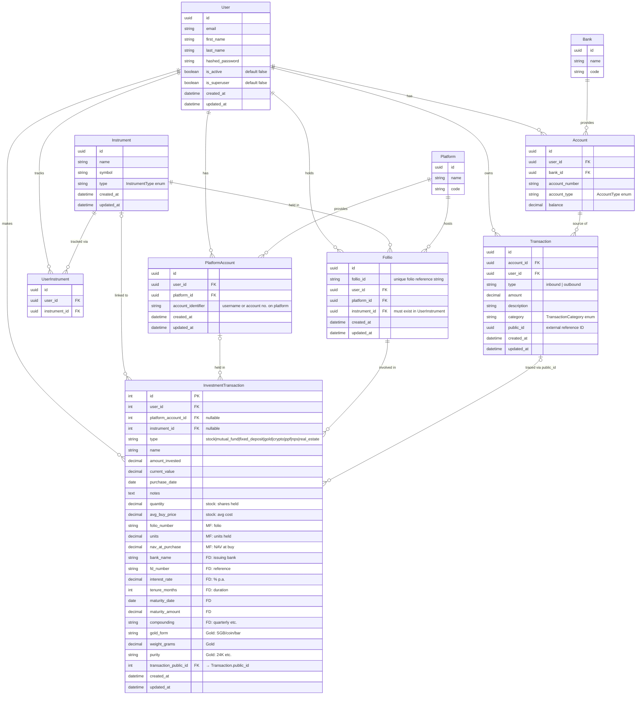

# FinTrack — Entity Relationship Diagram

> Based on `DB-Design.txt`. This reflects the **intended design**, not the current implementation.

## Design notes

### Follio
Represents a user's position account for a specific instrument on a specific platform — e.g. a mutual fund folio number, or a demat account holding for a particular stock. `instrument_id` must already exist in `UserInstrument` (i.e. the user must be tracking that instrument before creating a folio).

### InvestmentTransaction
Models individual **buy / sell events**, not snapshots. Uses a **polymorphic source → destination** pattern:

| Event | source_type | destination_type |
|---|---|---|
| Buy stock | `bank` (debit account) | `follio` (position increases) |
| Sell stock | `follio` (position decreases) | `bank` (credit account) |
| MF SIP | `bank` | `follio` |
| MF redemption | `follio` | `bank` |

`transaction_public_id` links back to the corresponding `Transaction.public_id` for full cash-flow traceability.

### TransactionCategory
`Transaction` carries a `category` enum (e.g. salary, rent, groceries, investment) for spending classification — not yet defined in the design file but implied by the field.

### Key divergences from current implementation
| Design | Current impl |
|---|---|
| `User.first_name` + `last_name` | `User.full_name` |
| `User.is_superuser` | Missing |
| `Account.balance` | Missing |
| `Transaction.category` | Missing |
| `Transaction.public_id` | Missing |
| `Follio` table | Missing — collapsed into `Investment` |
| `InvestmentTransaction` (buy/sell events) | `Investment` (snapshot of current holding) |
| Polymorphic source/destination | Not implemented |
| UUID primary keys | Integer primary keys |
