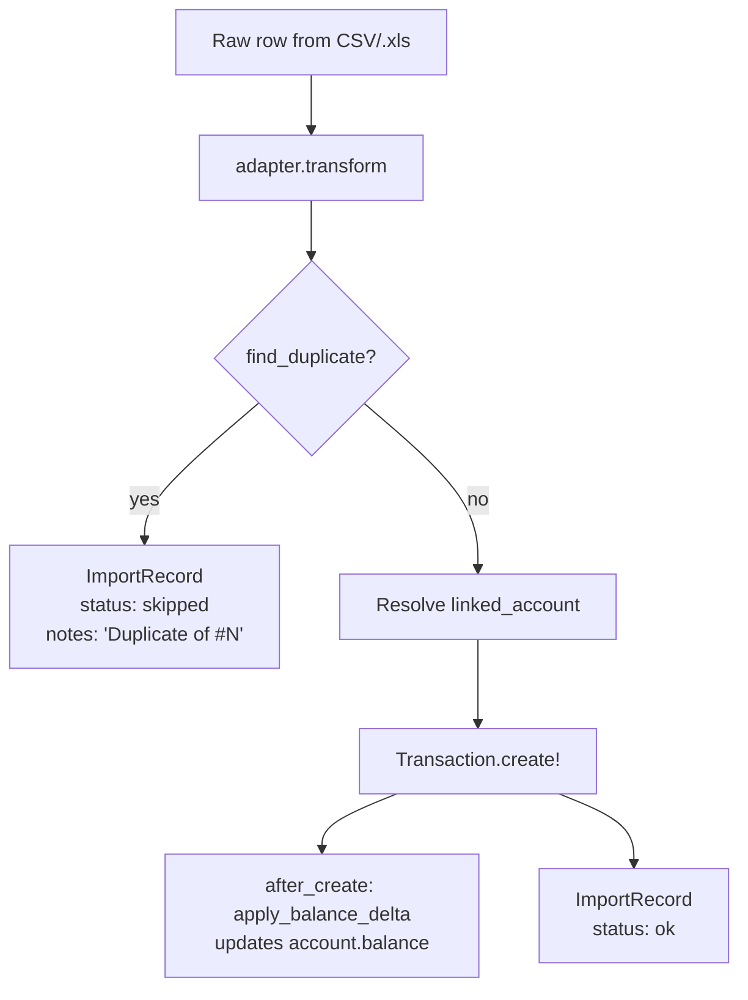

# Importer

How CSV / Excel statements get turned into FinTrack rows.

The importer runs in three places:

| Layer | File | Job |
|---|---|---|
| Transactions | `app/services/imports/process_transaction_row_service.rb` | `Imports::ProcessTransactionCsvJob` |
| Investments  | `app/services/imports/process_investment_row_service.rb`  | `Imports::ProcessInvestmentCsvJob`  |
| Term accounts | `app/services/imports/process_term_account_row_service.rb` | `Imports::ProcessTermAccountCsvJob` |

This doc focuses on **transactions**, which is the layer with format-specific adapters (ICICI .xls today, more banks later). Investments and term accounts use the same row-processor + dedup-ladder pattern but with a single canonical CSV format.

## Pieces

```
┌──────────────────────────────────────────────────────────────┐
│  POST /api/v1/imports  (file upload, type=transactions)      │
│         │                                                    │
│         ▼                                                    │
│  Api::V1::ImportsController#create                           │
│    – creates ImportBatch (status=pending)                    │
│    – attaches the uploaded file via ActiveStorage            │
│    – enqueues Imports::ProcessTransactionCsvJob              │
└────────────────────────────┬─────────────────────────────────┘
                             │  Sidekiq
                             ▼
   ┌───────────────────────────────────────────────────────┐
   │  Imports::ProcessTransactionCsvJob                    │
   │                                                       │
   │   1. Load rows (CSV or .xls via roo)                  │
   │   2. Pick adapter from header signature               │
   │   3. Normalise every row (adapter.transform)          │
   │   4. Capture expected_balance = last row's            │
   │      balance_after  (for end-of-import reconcile)     │
   │   5. seed_opening_balance_if_blank!                   │
   │      (ask adapter.opening_balance — see §"Seed")      │
   │   6. For each row → ProcessTransactionRowService      │
   │   7. finalize_with_reconciliation!                    │
   └───────────────────────────────────────────────────────┘
```

The split is deliberate:

- **Adapter** — knows the source format (column names, date strings, sign convention, which column carries the running balance). Its `transform(row)` returns FinTrack's canonical hash; its `opening_balance(rows)` describes how to derive a seed.
- **Row processor** — runs the dedup ladder, resolves the linked account, creates the `Transaction`, writes the `ImportRecord` audit row. Format-agnostic.
- **Job** — orchestrates: load → normalise → seed → row loop → reconcile.

When you add a new bank, you write only an adapter. The row processor and job stay untouched.

## Canonical row shape

The adapter's `transform` produces a hash with these keys (consumed by `ProcessTransactionRowService`):

| Key | Required | Notes |
|---|---|---|
| `date` | yes | `YYYY-MM-DD`, `DD/MM/YYYY`, or `DD-MM-YYYY` |
| `amount` | yes | positive number |
| `type` | yes | `"credit"` or `"debit"` |
| `description` | no | free text |
| `tags` | no | comma-separated string |
| `bank_ref` | no | UTR/UPI/NEFT ref. Adapters typically populate this. |
| `linked_account_nickname` | no | per-row account binding. nil → use batch-level `linked_account` |
| `balance_after` | no | running balance after this row. Used for end reconcile + opening seed |

## Per-row flow



## Dedup ladder

Lives in `ProcessTransactionRowService.duplicate_for` — class method, reusable from anywhere.

The uniqueness tuple is always `(date, amount, type, linked_account, bank_ref?)` — `bank_ref` is *part* of the key when present, not the whole key:

- A row dedups if every populated field matches an existing transaction for this user.
- Two ₹500 UPIs to the same merchant on the same day stay distinct (different UTR → different `bank_ref`).
- Recurring ICICI sweep / closure / interest entries that reuse the same remark string across different dates and amounts stay distinct too.
- A re-uploaded statement matches on all four/five fields, so it cleanly dedups.

A match writes an `ImportRecord` with `status: :skipped` and `notes: "Duplicate of Transaction #N (bank_ref … | date, ₹amount type)"`, and bumps `import_batches.duplicate_rows`.

> **Why not just `bank_ref` when it's present?** That's what the ladder used to do. ICICI (and many banks) reuse remark strings across genuinely distinct rows — e.g. ten `Rev Sweep From 328713003095` entries spanning a year, each with different dates and amounts. Keying on `bank_ref` alone collapsed all ten into one transaction and left the account short by the sum of the merged rows. Including `(date, amount, type)` in the key fixes that without weakening the "genuine repeat UPI" guarantee, because real repeat UPIs have *different* `bank_ref`s.

## End-of-import reconciliation

If the source file carries a running balance, the job sets `expected_balance = last_row[:balance_after]` and compares it to `account.balance` after all rows are processed:

| `on_balance_mismatch` | Behaviour on gap > 1 paisa |
|---|---|
| `ask` (default) | Batch ends `needs_reconciliation`; UI shows the gap, user resolves via `POST /imports/:id/resolve` |
| `adjust` | `Accounts::AdjustBalanceService` writes a balancing adjustment Transaction; batch `completed` |
| `fail` | `Imports::AbortBatchService` rolls back the batch's transactions |

If the adapter doesn't provide `balance_after`, reconciliation is skipped and the batch is marked `completed`.

## Opening balance seed (blank-account import)

A common case: user creates a fresh Account (balance 0, no transactions), then imports a bank statement that *starts* with a non-zero running balance. Without intervention the import would land short by `opening - 0`, and the end-of-import reconciliation would have to paper over the gap with a synthetic adjustment.

The seed handles this up front. Before the row loop, the job asks the active adapter for an `OpeningSeed`:

```ruby
adapter.opening_balance(normalised_rows)
  # → OpeningSeed.new(amount: 5000.00, anchor_row: first_row)  or  nil
```

Then materialises a single opening Transaction **only if** all of these hold:

1. The batch is linked to an `Account` (not a TermAccount).
2. `account.balance == 0` and the account has no Transactions yet.
3. `adapter.opening_balance(rows)` returned an `OpeningSeed` with `amount > 0`.
4. If the seed has an `anchor_row`, that row is **not** itself a duplicate per `ProcessTransactionRowService.duplicate_for` (otherwise the row would be skipped while the seed got applied — ledger ends up off by that row's delta).

The seed itself is a `source: "manual"` Transaction tagged `["adjustment", "opening"]`, dated on `account.open_date`, description `"Opening balance (import #N)"`. The model's `after_create :apply_balance_delta` callback bumps the account balance, and the imported rows that follow land on top of it.

**Why `manual` and not `imported`** — the row didn't come from the file. The user might want to edit or correct it later; `manual` rows accept narrow PUTs while `imported` rows are frozen.

### Per-adapter derivation

The math lives on the adapter so different banks can derive the opening differently:

```ruby
TransactionFormatAdapters::Default.opening_balance(rows)
TransactionFormatAdapters::Icici.opening_balance(rows)
```

Both currently delegate to a shared helper that back-calculates from row 1 (bank statements are chronological ascending by contract):

```
opening = first_row.balance_after − signed_first_delta
```

A future adapter (e.g. an HDFC statement that has an explicit "Opening Balance" header row) can implement `opening_balance` differently and return `OpeningSeed.new(amount: X, anchor_row: nil)` — anchor-nil signals "this came from an explicit source, no dedup check needed".

## Worked example — ICICI statement into a blank account

Setup: user creates `ICICI Primary` (balance 0, open_date 2026-03-01) and uploads `feb-statement.xls` with `on_balance_mismatch: ask`.

The ICICI .xls has three rows after the header:

| S No | Transaction Date | Remarks | Withdrawal | Deposit | Balance |
|---|---|---|---|---|---|
| 1 | 01-04-2026 | UPI/4089431/... | 500.00 | 0.00 | 49,500.00 |
| 2 | 02-04-2026 | NEFT-IN/SALARY-... | 0.00 | 30,000.00 | 79,500.00 |
| 3 | 05-04-2026 | ATM-WD/... | 2,000.00 | 0.00 | 77,500.00 |

### Step-by-step

1. **Adapter detection** — `TransactionFormatAdapters.for_headers` sees `[:s_no, :transaction_date, :transaction_remarks]` and picks `Icici`.

2. **Normalise every row** via `Icici.transform`. Row 1 becomes:
   ```ruby
   { date: "01-04-2026", amount: "500.0", type: "debit",
     description: "UPI/4089431/...", tags: nil,
     bank_ref: "ICICI:UPI/4089431/...", linked_account_nickname: nil,
     balance_after: 49500.0 }
   ```

3. **Expected balance** — `rows.map { ... }.compact.last = 77_500.00`.

4. **Seed** — account has balance 0 and no transactions; `Icici.opening_balance(rows)`:
   - First row: type=debit, amount=500, balance_after=49,500.
   - `delta = -500` (debit). `opening = 49,500 − (−500) = 50,000`.
   - Returns `OpeningSeed.new(amount: 50_000.00, anchor_row: row_1)`.
   - Job runs `row_1` through the dedup ladder — `bank_ref "ICICI:UPI/4089431/..."` doesn't exist anywhere for this user → not a duplicate → seed is safe.
   - Creates Transaction(credit, 50,000, dated 2026-03-01, tags=["adjustment","opening"], description="Opening balance (import #42)"). `apply_balance_delta` bumps account to **50,000**.

5. **Row loop**:
   - Row 1 → debit 500 → account 49,500.
   - Row 2 → credit 30,000 → account 79,500.
   - Row 3 → debit 2,000 → account 77,500.

6. **Reconcile** — `account.balance (77,500) == expected_balance (77,500)` → batch `completed`, no UI prompt.

### What the user sees

```
ImportBatch #42
  status: completed
  total_rows: 3
  processed_rows: 3
  duplicate_rows: 0
  failed_rows: 0
  expected_balance: 77,500.00

ICICI Primary
  balance: 77,500.00
  transactions:
    2026-03-01  credit  50,000.00  "Opening balance (import #42)"   tags=[adjustment, opening]
    2026-04-01  debit      500.00  "UPI/4089431/..."                bank_ref=ICICI:...
    2026-04-02  credit  30,000.00  "NEFT-IN/SALARY-..."             bank_ref=ICICI:...
    2026-04-05  debit    2,000.00  "ATM-WD/..."                     bank_ref=ICICI:...
```

### Re-uploading the same file

Run #2 of the same statement against the same account:

- Account is no longer blank → seed step is skipped.
- Every row's `bank_ref` matches the previously-imported row → all three are tagged `:skipped`.
- `duplicate_rows: 3`, no balance change, batch `completed`.

### Re-uploading to a different blank account (mistake)

User creates `ICICI Secondary` (blank) and re-uploads the same file to it:

- Account is blank → adapter returns an `OpeningSeed` from row 1.
- Anchor check: row 1's `bank_ref` already exists (on `ICICI Primary`) → seed is **not** applied.
- Row loop: every row marked `:skipped` (bank_ref dup).
- Account stays at 0; `duplicate_rows: 3`; batch `completed` with no surprise opening row left behind.

## Adding a new bank adapter

1. Add a module under `Imports::TransactionFormatAdapters` with two class methods:
   ```ruby
   module Hdfc
     def self.transform(row, batch: nil)
       # → canonical hash (see "Canonical row shape")
     end

     def self.opening_balance(normalised_rows)
       # → OpeningSeed or nil
     end
   end
   ```
2. Register a header signature in `TransactionFormatAdapters.for_headers`.
3. If the format carries a running balance, you can usually delegate `opening_balance` to the shared `TransactionFormatAdapters.back_calc_from_first_row(normalised_rows)` helper.
4. Add a fixture-driven spec under `spec/services/imports/`.

That's it — the row processor, dedup ladder, seed policy, and reconciliation flow are reused for free.
